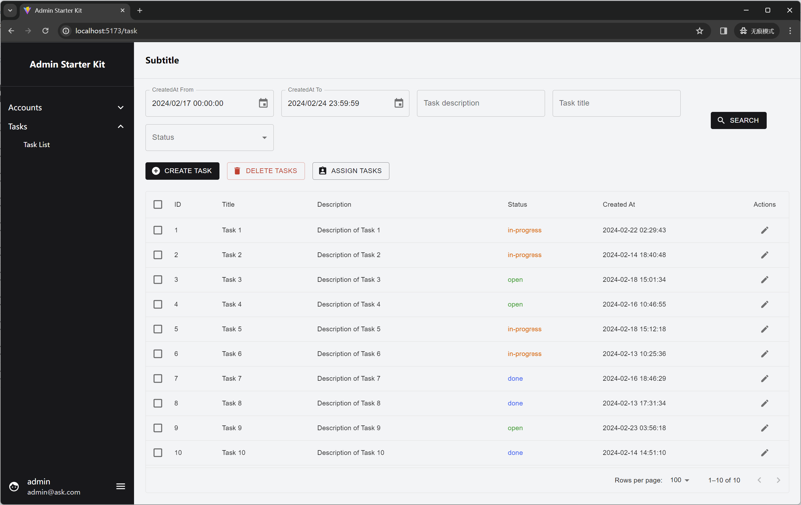

## Admin Starter Kit

This is a starter template using the following stack:

- [React](https://react.dev/)
- [TypeScript](https://www.typescriptlang.org/)
- [Vite](https://vitejs.dev/)
- [Tailwind CSS](https://tailwindcss.com/)
- [Meterial-UI](https://mui.com/material-ui/)
- [MUI X Data Grid](https://mui.com/x/react-data-grid/)
- [React Router](https://reactrouter.com/)
- [Day.js](https://day.js.org/)

### Login

### Sidebar and TaskList

